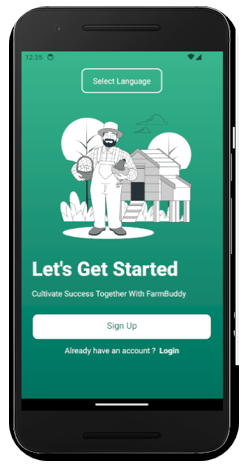
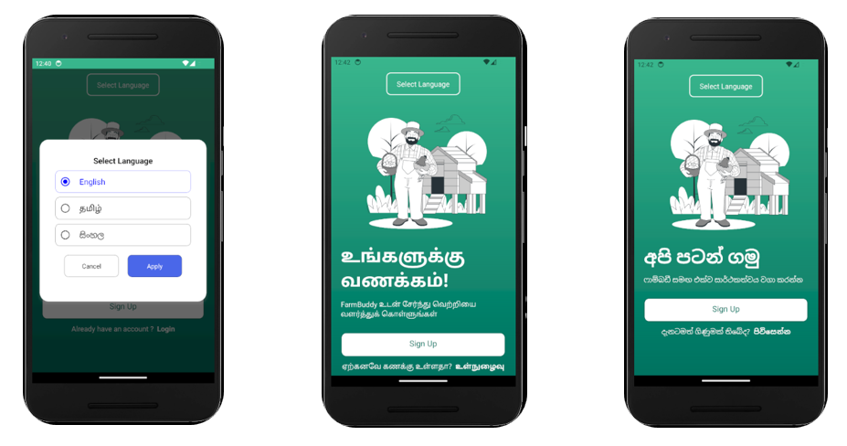

# Welcome to the FarmBuddy Mobile App 👋

## Project Overview

The FarmBuddyApp project aims to support small-scale farmers in Sri Lanka by providing a comprehensive mobile and web application tailored to their needs. The application delivers real-time updates, farming tips, market prices, and other essential resources to enhance agricultural productivity and improve livelihoods.


<p align="center">
  
</p>


## Features

- **Real-Time Updates**: Access up-to-date agricultural information and news.
- **Farming Tips**: Receive valuable tips and best practices for farming.
- **Market Prices**: Get current market prices for various crops and livestock.
- **Resource Access**: Utilize a range of resources to support farming activities.
- **Cross-Platform Availability**: Available on both mobile and web platforms.

<p align="center">
  
</p>

## Technologies Used

- **Mobile Development**: React Native, Expo
- **Web Development**: React.js
- **Backend**: Firebase
- **Development Environment**: VS code

## Getting Started

1. **Clone the Repository**: `git clone https://github.com/Nava-stack/farmbuddy-o1m0rfkhfuteb1j6q1fg.git`
2. **Setup**:
   - Install the necessary dependencies:
     ```bash
     npm install
     ```
   - For React Native development:
     - Install Expo CLI: `npm install -g expo-cli`
     - Start the Expo server: `expo start`
   - For web development:
     - Navigate to the web directory and start the development server:
       ```bash
       cd web
       npm start
       ```
3. **Configure Firebase**:
   - Set up Firebase and update the configuration files with your Firebase project credentials.

4. **Run the Application**:
   - Mobile: Use the Expo Go app or a physical device to test.
   - Web: Open your browser and navigate to the local development server URL.

## Design and Architecture

The project follows a user-centered design approach, ensuring that the application meets the needs of small-scale farmers. The design phase includes a detailed system architecture and requirements analysis.

## License

This project is licensed under the MIT License - see the [LICENSE](LICENSE) file for details.
